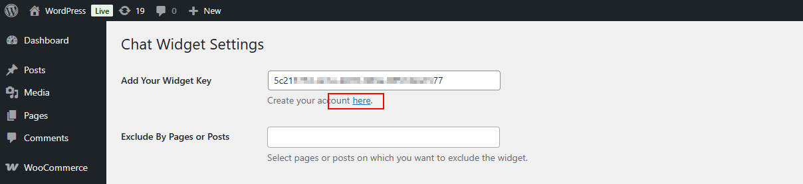
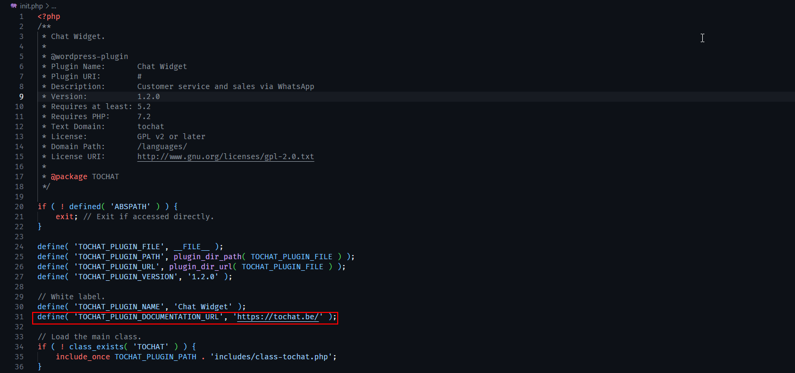

# White Label version of the ToChatBe.to Widget WordPress Plugin

A white label WordPress WhatsApp widget plugin for agencies

## FAQs:

### 1: How to change the "Create Your Account" link in the widget?

1. Extract the plugin zip file.
2. Open the `init.php` file in a text editor.
3. Find the line that contains `define( 'TOCHAT_PLUGIN_DOCUMENTATION_URL', 'https://tochat.be/' );`
    
4. Change the URL to your desired link, for example, `define( 'TOCHAT_PLUGIN_DOCUMENTATION_URL', 'https://yourwebsite.com/' );`
5. Save the file and re-zip the plugin.

